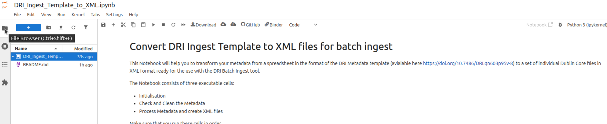
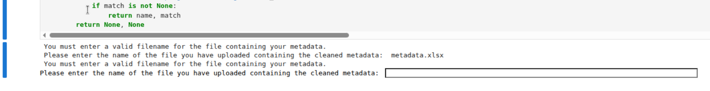

# dri-metadata-tools - Jupyter Notebooks - DRI Metadata Template to XML

Jupyter notebooks are documents that blend text, code and its output. They are often used to share a researcher's work in a transparent way, allowing all of the research processes and steps to be understood and reproduced.

This Jupyter Notebook will convert the [DRI Metadata Template spreadsheet](https://doi.org/10.7486/DRI.qn603p95v-8) to Dublin Core XML files.

To use this notebook, it is not necessary to fully understand what the code is doing. You simply need to run the code blocks in the correct order, and provide the appropriate input when requested. You can run the notebook in any Jupyter Notebook environment. To make it easier for you to run this notebook, we have also provided a Binder Launch button, which you will find at the bottom of these instructions. Binder is an online service for building and sharing reproducible and interactive computational environments from online repositories. Clicking on the Launch button will start up a Binder environment so that you can run this notebook in your browser without having to install or configure anything. We recommend using this approach if you are not very familiar with Jupyter Notebooks. Please note that GitHub MarkDown does not provide an option to automatically open links in a new tab or window. For that reason, we recommend that you right click on the Binder Launch button and select the option to open the link in a new tab.

Before using this notebook, you must ensure that your metadata is in a .xlsx spreadsheet format, with the Dublin Core metadata field names as column headings. If you don't already have your metadata in a suitable format, download and populate the [DRI Metadata Template spreadsheet](https://doi.org/10.7486/DRI.qn603p95v-8) with your metadata.

You can use tools such as [OpenRefine](https://openrefine.org/) to clean your metadata, but in order to use this notebook, you must re-export the cleaned metadata as a .xlsx file.

This notebook contains three code steps which must be executed in order. Before executing these, you must upload your metadata spreadsheet to a location accessible to your notebook, and create an output folder for the Dublin Core XML files. If you are using MyBinder to run the notebook, you should click on the Folder icon on the top left corner of the screen to open the File Manager.

As you execute the steps, you may see some output messages or be asked to provide input. This will happen immediately below the currently executing step. It is important to read these to see if you have encountered any errors, or to provide input when required.

If you see any errors in the input area you will likely have to re-run that step.

### Steps
1. The "Initialisation" step will set up the environment for the notebook and will ask you to identify the input metadata file and the output folder. It also creates some code functions which will be used.
2. The "Check and Clean the Metadata" step reads in your metadata file and performs some checks to make sure that it can be converted to Dublin Core XML files. It will ask you to identify the tab in your spreadsheet that contains the metadata and may ask you to identify the DC field to which to map any columns of your spreadsheet that it does not recognise.
3. The "Process Metadata and create XML files" step creates one XML file in Dublin Core format for each row in your spreadsheet. When all rows are processed, it will attempt to create a zipfile and tar.gz archive of the output folder which you can download (please note that one or other of these options may not be available on the particular Jupyter Notebook environment that you are using).

You can download this notebook to run in your preferred Jupyter Notebooks environment, or lauch this notebook in Binder by clicking on the Binder button. 

